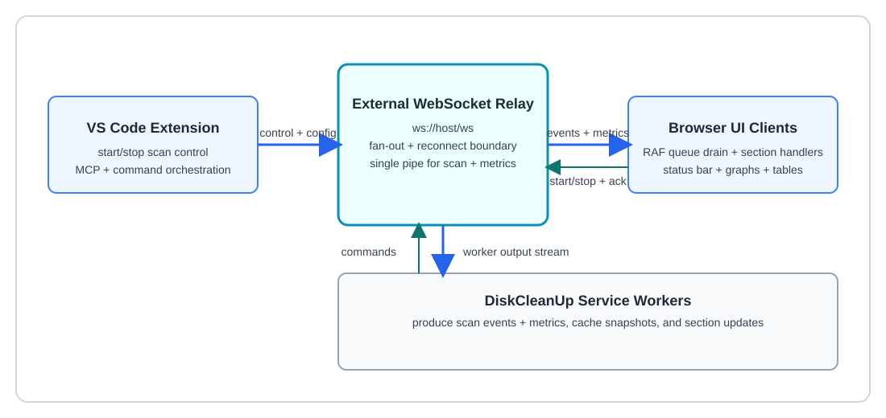

# Browser-Side Pipeline

## ① Page Load — `restoreCachedResults()`

On page load, the browser fetches cached scan results from the server for each section. This provides instant data display without waiting for a new scan.

```javascript
// page-loader.js
async function restoreCachedResults() {
  for (const section of ALL_SECTIONS) {
    const res = await fetch(`/api/cache/${section}`);
    const events = await res.json();
    events.forEach(ev => _eventQueue.push(ev));
  }
}
```

Each cached event enters the same `_eventQueue` as live scan events — the RAF drain loop doesn't distinguish between cached and live data.

## ② WebSocket Connect — `_wsConnect()`

Establishes a persistent WebSocket connection to `ws://{host}/ws`. On open, sets connection status to "⚡ Live". All scan events and metrics flow through this single socket.

The diagram below illustrates the communication architecture using an external WebSocket server as a relay between VS Code and web browsers.



## ③–④ Scan Trigger Flow

User clicks a scan button → `startScan(section)` → `SB.begin()` (status bar shows "Scanning…") → `_wsSend({ type: 'start', section })` sends JSON over the WebSocket to the server's read loop.

## ⑨ `_ws.onmessage`

All incoming WebSocket messages are JSON-parsed and routed:

- **metrics** events → update CPU/MEM graphs directly (bypass RAF)
- **scan events** → `_eventQueue.push(event)` → schedule RAF if not pending

## ⑩ RAF Drain — `_drainQueue()`

The heart of UI performance. Pops up to 20 events per animation frame (~16ms budget). Calls `_HANDLERS[section](event)` for each. If the queue still has items, schedules the next `requestAnimationFrame`. Otherwise stops scheduling (`_rafPending = false`).

**Why this exists:** Workers fire hundreds of events/second. Without the queue, every `onmessage` would hit the DOM — instant freeze. With the queue, events pile into a plain array (free), and RAF drains them at 60fps. Stale progress events are dropped if queue depth exceeds 50.

## ⑪–⑫ Section Handlers → CSS Grid Renderer

Each section has a registered handler (e.g., `DuplicatesSection.onEvent`). The handler calls `_ensureTable()` to create the grid if needed, then `_appendRow()` which builds DOM nodes in a `DocumentFragment`. One DOM append per frame — browser paints, yields, next frame drains 20 more.

## ⑰ Reconnect Policy

On WebSocket close: `setTimeout(_wsConnect, delay)` with exponential backoff: 0s → 2s → 5s → 10s → 20s + random jitter. Delay resets to 0 on successful `onopen`. Each browser tab reconnects independently — no thundering herd.

## ⑱ Status Bar, Error Log, Trash Queue

Metrics events (CPU, memory) bypass the RAF queue and update mini-graphs directly. The status bar, error log panel, and trash queue are always current regardless of scan event volume.

## ⑲ Cache Restore (Page Load Only)

On initial load, cached results from `/api/cache/{section}` are pushed into `_eventQueue` using the same path as live events. The grid populates immediately using the same RAF + handler pipeline.
